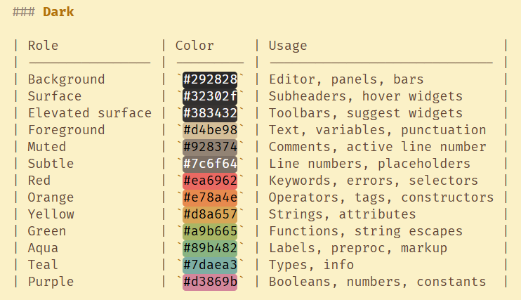
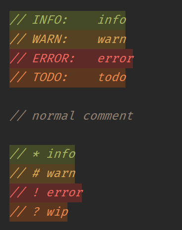
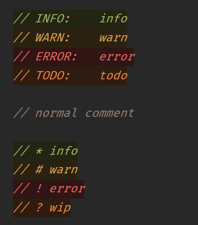
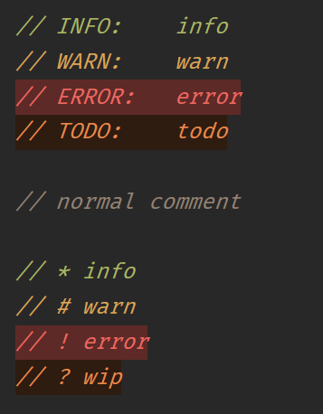

# Gruvbox Material Dark Port

Port of [sainnhe's Gruvbox Material](https://github.com/sainnhe/gruvbox-material) VSCode theme to Zed editor format. No changes were made to the original scheme.

## Features

- Lighter inlay hints
- [zed-comment](https://github.com/thedadams/zed-comment) support

---

## Color Palettes

### Dark

| Role             | Color     | Usage                         |
| ---------------- | --------- | ----------------------------- |
| Background       | `#292828` | Editor, panels, bars          |
| Surface          | `#32302f` | Subheaders, hover widgets     |
| Elevated surface | `#383432` | Toolbars, suggest widgets     |
| Foreground       | `#d4be98` | Text, variables, punctuation  |
| Muted            | `#928374` | Comments, active line number  |
| Subtle           | `#7c6f64` | Line numbers, placeholders    |
| Red              | `#ea6962` | Keywords, errors, selectors   |
| Orange           | `#e78a4e` | Operators, tags, constructors |
| Yellow           | `#d8a657` | Strings, attributes           |
| Green            | `#a9b665` | Functions, string escapes     |
| Aqua             | `#89b482` | Labels, preproc, markup       |
| Teal             | `#7daea3` | Types, info                   |
| Purple           | `#d3869b` | Booleans, numbers, constants  |



### Light

| Role             | Color     | Usage                         |
| ---------------- | --------- | ----------------------------- |
| Background       | `#fbf1c7` | Editor, panels, bars          |
| Surface          | `#f2e5bc` | Subheaders, overlays          |
| Elevated surface | `#eee0b7` | Active lines, toolbar         |
| Foreground       | `#654735` | Text, variables, punctuation  |
| Muted            | `#928374` | Comments, active line number  |
| Subtle           | `#a89984` | Line numbers, placeholders    |
| Red              | `#c14a4a` | Keywords, errors, selectors   |
| Orange           | `#c35e0a` | Operators, tags, constructors |
| Yellow           | `#b47109` | Strings, attributes           |
| Green            | `#6c782e` | Functions, string escapes     |
| Aqua             | `#4c7a5d` | Labels, preproc, markup       |
| Teal             | `#45707a` | Types, info                   |
| Purple           | `#945e80` | Booleans, numbers, constants  |


---

## Customization

### Customize [zed-comment](https://github.com/thedadams/zed-comment?tab=readme-ov-file#theme-overrides) highlights

Follow [zed-comment](https://github.com/thedadams/zed-comment?tab=readme-ov-file#theme-overrides) theme overrides:

```json
{
  "theme_overrides": {
    "Gruvbox Material Dark Port": {
      "syntax": {
        "constant.comment.todo": {}, // INFO: styles
        "string.comment.info": {}, // NOTE: styles
        "keyword.comment.warn": {}, // WARN: styles
        "property.comment.error": {} // ERROR: styles
      }
    }
  }
}
```

> Here is a handy tool for quick tints and shades based on this theme's accent colors:
>
> 1. [darkmode accents](https://maketintsandshades.com/#colors=ea6962,a9b665,d8a657,7daea3,d3869b,89b482,e78a4e&hashtag=0&steps=10)
> 2. [lightmode accents](https://maketintsandshades.com/#colors=c14a4a,6c782e,b47109,45707a,945e80,4c7a5d,c35e0a&hashtag=0&steps=10)

Here is a list of overrides (**click to expand**):

1.  <details>
    <summary>font-style normal comments</summary>

    > if italic is not for you

    ```json
    {
      "Gruvbox Material Dark Port": {
        "syntax": {
          "comment": {
            "font_style": "normal"
          },
          "comment.doc": {
            "font_style": "normal"
          },
          "constant.comment.todo": {
            "font_style": "normal"
          },
          "string.comment.info": {
            "font_style": "normal"
          },
          "keyword.comment.warn": {
            "font_style": "normal"
          },
          "property.comment.error": {
            "font_style": "normal"
          }
        }
      }
    }
    ```

    </details>

2.  <details>
    <summary>lighter background (<i>colorful</i>)</summary>

    > use the [tint & shade tool](https://maketintsandshades.com/#colors=c14a4a,6c782e,b47109,45707a,945e80,4c7a5d,c35e0a&hashtag=0&steps=10) for lightmode

    ```json
    {
      "Gruvbox Material Dark Port": {
        "syntax": {
          "constant.comment.todo": {
            "background_color": "#5c371f"
          },
          "string.comment.info": {
            "background_color": "#444928"
          },
          "keyword.comment.warn": {
            "background_color": "#564223"
          },
          "property.comment.error": {
            "background_color": "#5e2a27"
          }
        }
      }
    }
    ```

    

    </details>

3.  <details>
    <summary>darker background</summary>

    > use the [tint & shade tool](https://maketintsandshades.com/#colors=c14a4a,6c782e,b47109,45707a,945e80,4c7a5d,c35e0a&hashtag=0&steps=10) for lightmode

    ```json
    {
      "Gruvbox Material Dark Port": {
        "syntax": {
          "constant.comment.todo": {
            "background_color": "#2e1c10"
          },
          "string.comment.info": {
            "background_color": "#222414"
          },
          "keyword.comment.warn": {
            "background_color": "#2b2111"
          },
          "property.comment.error": {
            "background_color": "#2f1514"
          }
        }
      }
    }
    ```

    

    </details>

<details>
<summary>This is what I use (<i>click to expand</i>)</summary>

```json
{
  "Gruvbox Material Dark Port": {
    "syntax": {
      "constant.comment.todo": {
        "background_color": "#2e1c10"
      },
      "string.comment.info": {},
      "keyword.comment.warn": {},
      "property.comment.error": {
        "background_color": "#5e2a27"
      }
    }
  }
}
```



</details>
